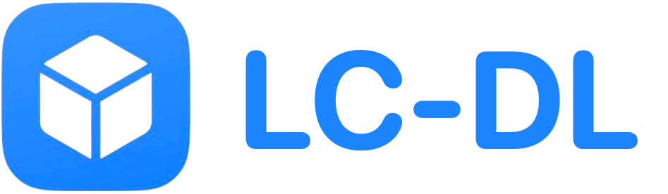

  

### What is it?
LC-DL is an app downloader for LiveContainer! It's built specifically for LC which grants full compatibility. Tweaks, data folders, and settings can all be setup automatically when you install an app!

### How do I use it?
To use LC-DL you can get started with either an LC-DL code or a blue LC-DL button. LC-DL supports downloading individual apps or saving and downloading apps from an online repository!

### Currently Available Apps
See a list of apps that are available to download now at lc-dl.github.io/apps
